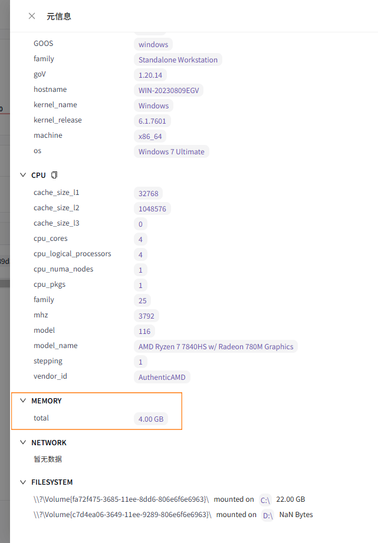

# categraf-win7-server2008

官方从 v0.3.46 起用 Go 1.21 出包，Win7 / Server 2008 R2 无法运行。还能跑的旧包（如 0.3.45）接到夜莺 9.1 后，元信息经常是空的。

这里是官方 [v0.3.87](https://github.com/flashcatcloud/categraf/tree/v0.3.87) 源码，用 **Go 1.20.14** 编出来的 Windows 包。

可用：Windows 7、Server 2008 R2、Server 2012  
不可用：Server 2008（非 R2）

## 下载

64 位：https://github.com/glj2369/categraf-win7-server2008/releases/download/v0.3.87/categraf-v0.3.87-windows7-amd64.zip

32 位：https://github.com/glj2369/categraf-win7-server2008/releases/download/v0.3.87/categraf-v0.3.87-windows7-386.zip

解压后是 `categraf.exe`、`conf`、`scripts`。按系统选包，不要混用。

## 旧包在夜莺上的情况

有心跳，元信息对不上：

- PLATFORM / CPU / MEMORY / NETWORK / FILESYSTEM 显示「暂无数据」
- 中文系统解析 `ipconfig` 失败，网卡为空，严重时整份元数据都不报
- 列表 CPU 低负载时显示 0.0%，看起来像没采到

## 本版本特点

- 能在 Win7 / 2008 R2 / 2012 上运行（含 32 位）
- 夜莺 9.1 能看到平台、CPU、内存、文件系统、网卡
- 中文 Windows 网卡能解析
- 32 位不再因 ethtool 采集 panic；服务改为开机延迟启动




## 相对官方 v0.3.87 的改动

源码在 [`categraf/`](categraf/)。

| 文件 | 改动 |
|---|---|
| `go.mod` | `go 1.21` → `1.20` |
| `heartbeat/network/network_windows.go` | `chcp 65001` 后再跑 `ipconfig /all` |
| `inputs/mtail/.../reader.go` | 去掉 Go 1.21 的 `min()` |
| `agent/metrics_reader.go` | 32 位 atomic 对齐 |
| `inputs/ethtool/ethtool_notlinux.go` | 非 Linux 不启动 ethtool |
| `agent/install/service_windows.go` | 延迟启动，失败后自动重启 |

## 安装

改 `conf/config.toml` 的 `[[writers]]` 指向夜莺：

```
categraf.exe --install
categraf.exe --start
```

升级只换 exe，不要覆盖已有 `conf`。若已装过服务，先 `--remove` 再 `--install`，延迟启动才会生效。`--stop` / `--status` 可用。

## License

[MIT](LICENSE)，与上游 [categraf](https://github.com/flashcatcloud/categraf) 相同。
